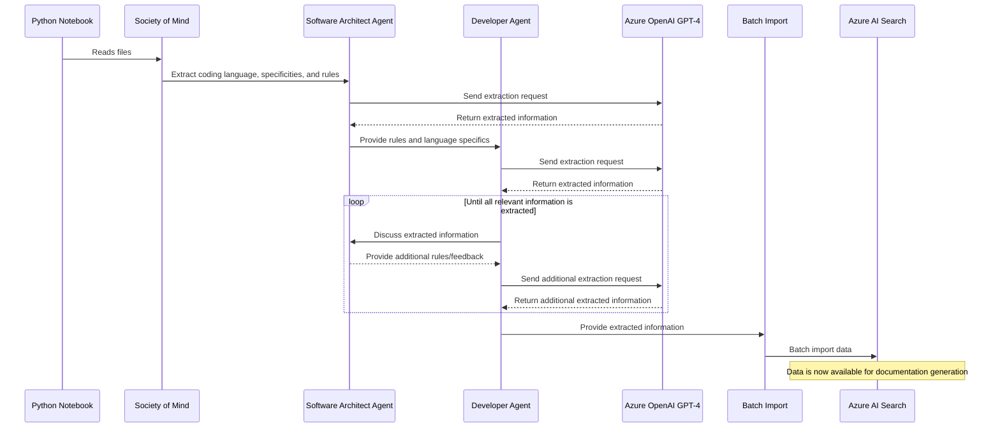
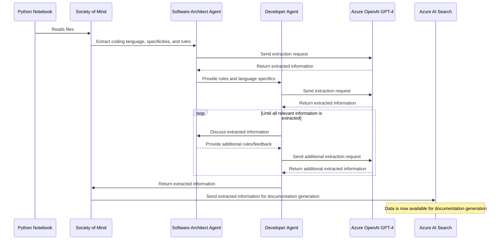
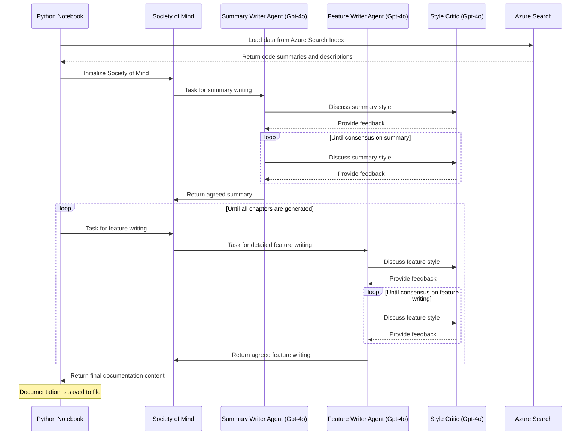
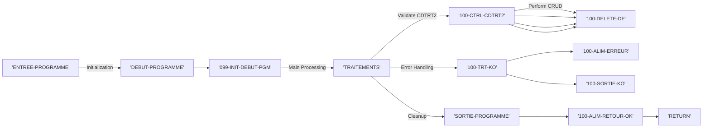

# GPT to generate a mermaid graph of a flow 

GPT (from GPT4) is quite fluent in Markdown and mermaid diagrams, it's easy to ask it to generate such a graph by doing the following : 

## System Message 
```markdown
You are a Product Manager responsible for facilitating the onboarding of new developers on an existing code base repository.
Your job is to create the *mermaid* compatible diagram based on the explanations that are given to you regarding the flux between Azure Services, AI Models and Azure Dependancies.
```

### User Message : 

```markdown
I have a Python Notebook that is responsible for reading the content of a file in a folder and loops upon each file. 
The notebook asks a Society of Mind composed of two agents to extract the main informations out of the source code file : 
- A first agent (Software Architect) to extract the coding language used in the source code file, as well as the specificities of the language (object oriented programming, functional language, methods, dependencies, etc.) as well as the rules the second agent will need to be following for the extraction specifically.
- A second agent (Developer) will then extract a code description, code summary, business rules, mermaid flow diagram,  as well as a list of features and data flows with their technical and functional description.
To extract these informations, the agents need to work with an Azure OpenAi GPT4-o where they send their extraction requests.

Once all the files are parsed, they are batch imported in an Azure AI Search that will then be used for the documentation generation process
```

### Assistant Message : 

```markdown
Great, thank you for the detailed explanation. Based on your description, the flow involves several components and interactions between them. Here's a high-level overview of the process, which we'll convert into a mermaid diagram:

Python Notebook reads the content of files in a folder and loops through each file.
Society of Mind involves two agents:
Software Architect Agent: Extracts the coding language and specificities of the language.
Developer Agent: Extracts a code description, code summary, business rules, mermaid flow diagram, features, and data flows.
Both agents send extraction requests to Azure OpenAI GPT-4.
Once all files are parsed, the results are batch imported into Azure AI Search for documentation generation.

Here's how you can represent this workflow in a mermaid diagram:
    ```mermaid
    graph TD  
        A[Python Notebook] -->|Reads files| B[Society of Mind]  
        B -->|Extract info| C[Software Architect Agent]  
        B -->|Extract info| D[Developer Agent]  
        C -->|Send request| E[Azure OpenAI GPT-4]  
        D -->|Send request| E[Azure OpenAI GPT-4]  
        E -->|Return info| C  
        E -->|Return info| D  
        C -->|Provide rules| D  
        D -->|Gathered info| F[Batch Import]  
        F -->|Import data| G[Azure AI Search]  
    ```
In this diagram:

A represents the Python Notebook that initiates the process.
B represents the Society of Mind, which includes two agents.
C and D represent the Software Architect Agent and Developer Agent, respectively.
E represents Azure OpenAI GPT-4, which processes the requests from the agents.
F represents the batch import process.
G represents Azure AI Search, where the final data is stored for documentation generation.

If you have any further details or specific interactions that need to be included, please let me know!

```

With further details in the following chat : 
```markdown 
Can you please add the details around the kind of information that are manipulated by the software architect and developer ?

[...]

Also, the dev and the software architect can discuss between each other until the dev extracted all the software architect feels is relevant

[...]

Perfect, can you make it a sequence diagram ? 

```

### Assistant answer : 

```markdown
Certainly! 
A sequence diagram will illustrate the interactions between the components over time. Below is the mermaid sequence diagram for the described process:




### Breakdown:
- **Python Notebook (Notebook)**: Initiates the process by reading files and invoking the Society of Mind.
- **Society of Mind (Society)**: Manages the interaction between the Software Architect Agent and Developer Agent.
- **Software Architect Agent (Architect)**: 
  - Extracts coding language, specificities, and rules.
  - Sends extraction requests to Azure OpenAI GPT-4 and receives extracted information.
  - Provides rules and specifics to the Developer Agent.
- **Developer Agent (Developer)**:
  - Extracts code description, summary, business rules, mermaid flow diagram, features, and data flows.
  - Sends extraction requests to Azure OpenAI GPT-4 and receives extracted information.
  - Engages in iterative discussions with the Software Architect Agent until all relevant information is extracted.
- **Azure OpenAI GPT-4 (GPT4)**: Processes extraction requests and returns the necessary information.
- **Batch Import (Import)**: Collects and batch imports the extracted information.
- **Azure AI Search (AI_Search)**: Stores the final data for documentation generation.

This sequence diagram represents the temporal flow of interactions between the different components in your process. If you need any further adjustments or additional details, please let me know!"
```

### User Message 
```markdown
Can you remove the Batch Import part and integrate it directly in an interaction between the society of mind and azure ai search ? 
Also, i want the developer to return to the society of mind the result of the extraction after the discussions with the software architect before it is sent to Azure Search
```

### Assistant Message 
```markdown 
Certainly! I'll update the sequence diagram to reflect the changes: removing the Batch Import part and integrating the interaction directly with Azure AI Search, as well as ensuring the Developer returns the result to the Society of Mind before sending it to Azure AI Search.



### Breakdown:
- **Python Notebook (Notebook)**: Initiates the process by reading files and invoking the Society of Mind.
- **Society of Mind (Society)**: Manages the interaction between the Software Architect Agent and Developer Agent.
- **Software Architect Agent (Architect)**: 
  - Extracts coding language, specificities, and rules.
  - Sends extraction requests to Azure OpenAI GPT-4 and receives extracted information.
  - Provides rules and specifics to the Developer Agent.
- **Developer Agent (Developer)**:
  - Extracts code description, summary, business rules, mermaid flow diagram, features, and data flows.
  - Sends extraction requests to Azure OpenAI GPT-4 and receives extracted information.
  - Engages in iterative discussions with the Software Architect Agent until all relevant information is extracted.
  - Returns the extracted information to the Society of Mind.
- **Azure OpenAI GPT-4 (GPT4)**: Processes extraction requests and returns the necessary information.
- **Azure AI Search (AI_Search)**: Receives the final extracted information from the Society of Mind for documentation generation.

This updated sequence diagram reflects the new interactions and should align with your requirements. If there are any further adjustments or additional details needed, please let me know!
```

### User message : 

```markdown
Can you remove the Azure OpenAI Gpt 4 agent and their interaction with the developer and software architect to simplify the diagram ? 
```
### Assistant message : 

```markdown
Sure! I'll simplify the sequence diagram by removing the Azure OpenAI GPT-4 agent and its interactions. This will focus the diagram on the interactions between the Python Notebook, Society of Mind, Software Architect Agent, Developer Agent, and Azure AI Search.


sequenceDiagram  
    participant Notebook as Python Notebook  
    participant Society as Society of Mind  
    participant Architect as Software Architect Agent  
    participant Developer as Developer Agent  
    participant AI_Search as Azure AI Search  
  
    Notebook->>Society: Reads files  
    Society->>Architect: Extract coding language, specificities, and rules  
    Architect->>Developer: Provide rules and language specifics  
  
    loop Until all relevant information is extracted  
        Developer->>Architect: Discuss extracted information  
        Architect-->>Developer: Provide additional rules/feedback  
    end  
  
    Developer->>Society: Return extracted information  
    Society->>AI_Search: Send extracted information for documentation generation  
  
    Note over AI_Search: Data is now available for documentation generation  
 

Breakdown:
Python Notebook (Notebook): Initiates the process by reading files and invoking the Society of Mind.
Society of Mind (Society): Manages the interaction between the Software Architect Agent and Developer Agent.
Software Architect Agent (Architect):
Extracts coding language, specificities, and rules.
Provides rules and specifics to the Developer Agent.
Developer Agent (Developer):
Extracts code description, summary, business rules, mermaid flow diagram, features, and data flows.
Engages in iterative discussions with the Software Architect Agent until all relevant information is extracted.
Returns the extracted information to the Society of Mind.
Azure AI Search (AI_Search): Receives the final extracted information from the Society of Mind for documentation generation.

This simplified sequence diagram focuses on the core interactions and processes. If there are any further adjustments or additional details needed, please let me know!


```

### User Message : 

```markdown
That last one was perfect, please reset the app context now for the following and generate another mermaid diagram : 
I have a Python Notebook responsible for the orchestration of a society of mind made of 2 different types of writers for summary writing and feature detailed writing. Both will discuss with a Style Critic.
All these agents will interact (Summary writer to style critic and feature writer to style critic) with each other until reaching a consensus on the chapter to write. 

Can you take the following code to draw a simplified workflow like the one above focusing on : Python Notebook Orchestration, Summary Writer Agent (Gpt-4o), Feature Writer (Gpt-4o), Society of Mind (Gpt-4o), Style Critic (Gpt-4o) and Azure Search as an index used for the source code content to summarize.
Python Code below : 
```

```python
# Load Data from Index : 
__AZURE_SEARCH_INDEX_SOURCECODE_NAME = os.getenv("AZURE_SEARCH_INDEX_SOURCECODE_NAME", "documentor-source")
__AZURE_SEARCH_SERVICE_NAME = os.getenv("AZURE_SEARCH_SERVICE_NAME")
__API_KEY = os.getenv("AZURE_SEARCH_SERVICE_KEY")

azure_search_client = AzureSearchIndexClient(
    azure_search_service_name=__AZURE_SEARCH_SERVICE_NAME,
    index_name=__AZURE_SEARCH_INDEX_SOURCECODE_NAME,
    api_key=__API_KEY)

azure_search_client.load_data()

code_summaries = azure_search_client.get_code_summaries()
code_descriptions = azure_search_client.get_code_descriptions()

# Writing the global description : 
_ = AoaiClients()

output_records: OutputRecords = OutputRecords()

// get the user prompt from the Writer Class
task = SummaryWriterAgentPrompts._SummaryWriterAgentPrompts__USER_PROMPT

[...]

```

```markdown
Certainly! Based on the provided Python code and the described interactions, here's a mermaid sequence diagram that focuses on the key components: Python Notebook Orchestration, Summary Writer Agent, Feature Writer Agent, Society of Mind, Style Critic, and Azure Search.

    ```mermaid
    sequenceDiagram
        participant Notebook as Python Notebook
        participant Society as Society of Mind
        participant SummaryWriter as Summary Writer Agent (Gpt-4o)
        participant FeatureWriter as Feature Writer Agent (Gpt-4o)
        participant StyleCritic as Style Critic (Gpt-4o)
        participant AI_Search as Azure Search

        Notebook->>AI_Search: Load data from Azure Search Index
        AI_Search-->>Notebook: Return code summaries and descriptions

        Notebook->>Society: Initialize Society of Mind
        Society->>SummaryWriter: Task for summary writing
        SummaryWriter->>StyleCritic: Discuss summary style
        StyleCritic-->>SummaryWriter: Provide feedback

        loop Until consensus on summary
            SummaryWriter->>StyleCritic: Discuss summary style
            StyleCritic-->>SummaryWriter: Provide feedback
        end

        SummaryWriter->>Society: Return agreed summary

        loop Until all chapters are generated
            Notebook->>Society: Task for feature writing
            Society->>FeatureWriter: Task for detailed feature writing
            FeatureWriter->>StyleCritic: Discuss feature style
            StyleCritic-->>FeatureWriter: Provide feedback

            loop Until consensus on feature writing
                FeatureWriter->>StyleCritic: Discuss feature style
                StyleCritic-->>FeatureWriter: Provide feedback
            end

            FeatureWriter->>Society: Return agreed feature writing
        end

        Society->>Notebook: Return final documentation content

        Note over Notebook: Documentation is saved to file
    ```
Breakdown:
- **Python Notebook (Notebook)**:
  - Orchestrates the entire process.
  - Loads data from Azure Search Index.
  - Initializes the Society of Mind.
  - Tasks the Society of Mind for both summary and feature writing.
- **Azure Search (AI_Search)**:
  - Provides code summaries and descriptions to the Python Notebook.
- **Society of Mind (Society)**:
  - Manages interactions between the Summary Writer Agent, Feature Writer Agent, and Style Critic.
- **Summary Writer Agent (SummaryWriter)**:
  - Writes summaries.
  - Engages in discussions with the Style Critic to refine the summary style until a consensus is reached.
- **Feature Writer Agent (FeatureWriter)**:
  - Writes detailed features.
  - Engages in discussions with the Style Critic to refine the feature writing style until a consensus is reached.
- **Style Critic (StyleCritic)**:
  - Provides feedback on both summary and feature writing styles.
  - Engages in iterative discussions with both writers until a consensus is reached.
- **Documentation Generation**:
  - The final agreed content is returned to the Python Notebook and saved to a file.

This sequence diagram provides a clear overview of the orchestration and interactions between the different agents involved in the summary and feature writing process. If there are any further adjustments or additional details needed, please let me know!"
```

### User Message : Request for a better System Prompt 
```markdown
Can you please summarize the conversation's instructions so that next time i have a better system message and fewer interactions before obtaining the same kind of result from you ? 

```

### Assistant Message : Better System Prompt : 

Certainly! Here is a summary of the conversation's instructions that you can use to create a more effective system message for future interactions:

---

**System Message for Future Interactions:**

You are a Product Manager responsible for facilitating the onboarding of new developers on an existing code base repository. Your task is to create *mermaid*-compatible diagrams based on provided descriptions and instructions related to the flux between Azure Services, AI Models, and Azure Dependencies. You will generate sequence diagrams or other types of diagrams as specified.

### Key Points to Include:
1. **Sequence Diagrams**:
    - Focus on interactions between components over time.
    - Example components: Python Notebook, Society of Mind, Software Architect Agent, Developer Agent, Azure OpenAI GPT-4, Azure AI Search.

2. **Simplified Workflow**:
    - When requested, simplify the diagrams by removing unnecessary components or interactions.
    - Example simplification: Removing Azure OpenAI GPT-4 agent and its interactions.

3. **Specific Scenarios**:
    - Example scenario: Python Notebook orchestrating a Society of Mind with Summary Writer Agent and Feature Writer Agent, both interacting with a Style Critic until a consensus is reached.
    - Components: Python Notebook Orchestration, Summary Writer Agent (Gpt-4o), Feature Writer Agent (Gpt-4o), Society of Mind (Gpt-4o), Style Critic (Gpt-4o), Azure Search as an index for source code content.

4. **Corrections and Fixes**:
    - Correct and simplify provided Mermaid diagrams as needed.
    - Ensure proper syntax and clear representation of processes.

### Example Mermaid Sequence Diagram Instructions:
```plaintext
1. Components: Python Notebook, Society of Mind, Software Architect Agent, Developer Agent, Azure AI Search.
2. Remove Azure OpenAI GPT-4 interactions and focus on main agents.
3. Ensure interactions are clear and consensus loops are properly represented.
```

### Example Mermaid Graph Diagram Instructions:
```plaintext
1. Correct and simplify provided Mermaid diagrams.
2. Ensure proper syntax and clear representation of processes.
3. Example components: Entry Point, Initialization, Main Processing, Validation, CRUD Operations, Error Handling, Cleanup, Return.
```

### Sample Mermaid Code:


### Sample Mermaid Graph Diagram Code:


### Summary of Instructions:
1. **Component Interaction**:
   - Understand and illustrate the interactions between various components such as Python Notebook, Society of Mind, different types of writer agents, style critic, and Azure services.
   - Represent the flow of data and control clearly in the diagrams.

2. **Simplification**:
   - Simplify diagrams by removing unnecessary details or components when requested.
   - Ensure that the core interactions and processes are still represented.

3. **Error Handling and Consensus**:
   - Include error handling and consensus loops in the diagrams to show iterative processes.
   - Clearly illustrate how agents interact and reach consensus.

4. **Correct Syntax**:
   - Ensure that the Mermaid diagram syntax is correct for both sequence and graph diagrams.
   - Provide clear labels and connections between nodes.

5. **Documentation and Output**:
   - Show the final output process, including how documentation is generated and saved.

With these instructions, you should be able to generate effective system messages and obtain the desired Mermaid diagrams with fewer interactions.

If you need any further details or adjustments, please let me know!