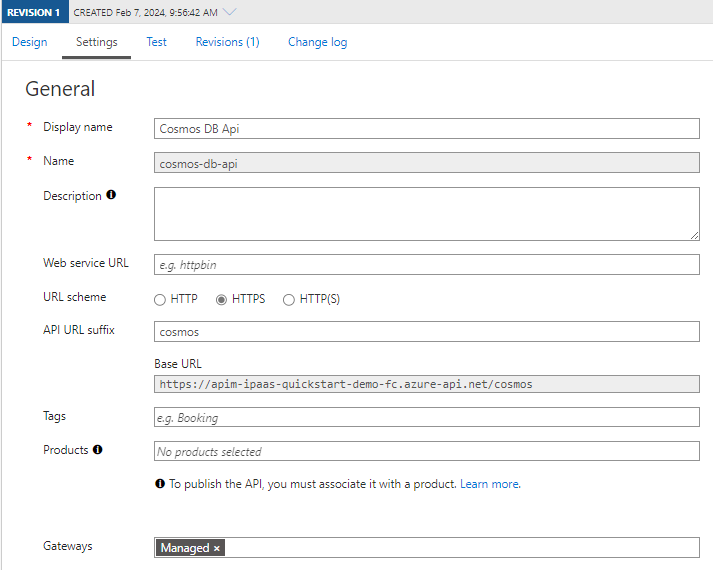
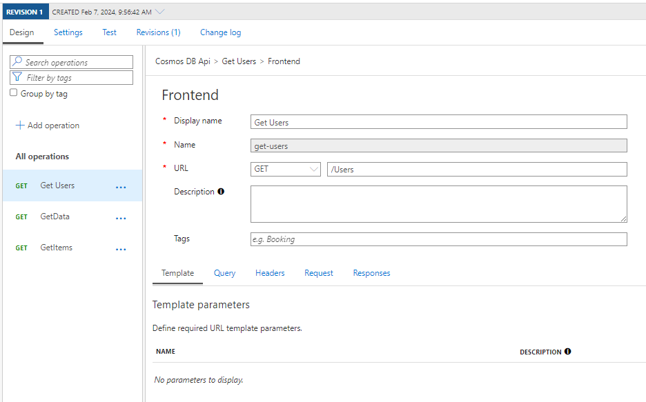
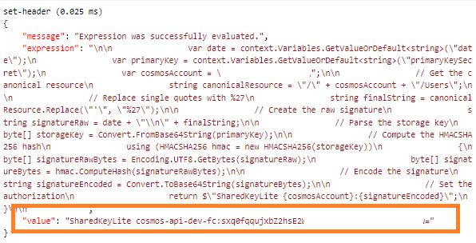

# APIM : Custom Policy to connect to Cosmos DB / Azure Storage Table API via Primary Key

## APIM setting

Below is the API setting screen : 



Below is the Get Operation being presented and used by the Table API to access a specific table ([could be extended with specific items filter][table-query-entities]).
</br>
The current setting will get all items in the `Users` table



This version uses a key vault to store the CosmosDb Primary Key, so make sure to have a Managed Identity (system or user-defined) set to the APIM instance and give it at least read rights to the KeyVault at secret level ([Key Vault Secrets User][key-vault-secrets-user-right]).


## API or Operation Custom C# Policy 

Then create the policy at the scope you expect (probably API or Operation level)

```xml

<policies>
    <inbound>
        <base />
        <set-backend-service base-url="https://<cosmos db name>.table.cosmos.azure.com" />
        <set-variable name="date" value="@(DateTime.UtcNow.ToString("r"))" />
        <set-header name="Content-Type" exists-action="override">
            <value>application/json</value>
        </set-header>
        <set-header name="Accept" exists-action="override">
            <value>application/json;odata=nometadata</value>
        </set-header>
        <set-header name="x-ms-date" exists-action="override">
            <value>@(context.Variables.GetValueOrDefault<string>("date"))</value>
        </set-header>

        
        <send-request mode="new" response-variable-name="primaryKeyResponse" timeout="20" ignore-error="false">
            <set-url>https://<keyvault-name>.vault.azure.net/secrets/<secret-name>/?api-version=7.0</set-url>
            <set-method>GET</set-method>
            <authentication-managed-identity resource="https://vault.azure.net" />
        </send-request>
        <!-- Could be replaced with secret named value and avoid AKV external call -->
        <set-variable name="primaryKeySecret" value="@{
                    var secret = ((IResponse)context.Variables["primaryKeyResponse"]).Body.As<JObject>();
                    return secret["value"].ToString();
                }" />
        <set-header name="Authorization" exists-action="override">
            <value>@{

                var date = context.Variables.GetValueOrDefault<string>("date");
                var primaryKey = context.Variables.GetValueOrDefault<string>("primaryKeySecret");
                var cosmosAccount = "<named-value, request param or actual name>";

                // Get the canonical resource
                string canonicalResource = "/" + cosmosAccount + "/Users";

                // Replace single quotes with %27
                string finalString = canonicalResource.Replace("'", "%27");

                // Create the raw signature
                string signatureRaw = date + "\n" + finalString;

                // Parse the storage key
                byte[] storageKey = Convert.FromBase64String(primaryKey);

                // Compute the HMACSHA256 hash
                using (HMACSHA256 hmac = new HMACSHA256(storageKey))
                {
                    byte[] signatureRawBytes = Encoding.UTF8.GetBytes(signatureRaw);
                    byte[] signatureBytes = hmac.ComputeHash(signatureRawBytes);

                    // Encode the signature
                    string signatureEncoded = Convert.ToBase64String(signatureBytes);

                    // Set the authorization
                    return $"SharedKeyLite {cosmosAccount}:{signatureEncoded}";
                }
            }</value>
        </set-header>
    </inbound>
    <!-- Other policies if required-->
</policies>
```

And the result detailed when tracing the api call steps, via `trace` inspection :  



## KUDOs  

Special thanks to [@LiviuIeran][kudos] for providing a Postman collection reproducing the expected behavior : 
- [LiviuIeran/PostmanRESTCosmosTableAPI (github.com)][kudos-repo]

## References 

- [Authorize with Shared Key (REST API) - Azure Storage | Microsoft Learn](https://learn.microsoft.com/en-us/rest/api/storageservices/authorize-with-shared-key)
- [Query Entities (REST API) - Azure Storage | Microsoft Learn][table-query-entities]
- [Payload format for Table service operations (REST API) - Azure Storage | Microsoft Learn](https://learn.microsoft.com/en-us/rest/api/storageservices/payload-format-for-table-service-operations#see-also)
- [Azure Cosmos DB REST API Reference | Microsoft Learn](https://learn.microsoft.com/en-us/rest/api/cosmos-db/)
- [Troubleshoot Azure Cosmos DB unauthorized exceptions | Microsoft Learn](https://learn.microsoft.com/en-us/azure/cosmos-db/nosql/troubleshoot-unauthorized)
- [Addressing Table service resources (REST API) - Azure Storage | Microsoft Learn](https://learn.microsoft.com/en-us/rest/api/storageservices/addressing-table-service-resources)
- [Authorize with Shared Key (REST API) - Azure Storage | Microsoft Learn](https://learn.microsoft.com/en-us/rest/api/storageservices/authorize-with-shared-key#encoding-the-signature)

[table-query-entities]:https://learn.microsoft.com/en-us/rest/api/storageservices/query-entities
[key-vault-secrets-user-right]:https://learn.microsoft.com/en-us/azure/key-vault/general/rbac-guide?tabs=azure-cli#azure-built-in-roles-for-key-vault-data-plane-operations
[kudos]:https://github.com/LiviuIeran/
[kudos-repo]:https://github.com/LiviuIeran/PostmanRESTCosmosTableAPI