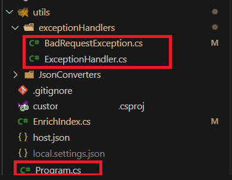

# Azure Function Dotnet Isolated - Catch any CustomException in a Middleware

Have you ever wondered how you could simplify the most your coding base to improve its readability and reducing the code duplication?
What if you develop an Azure Function API with various endpoints, and want to standardize the response to the client in case an exception occurs during the execution of the logic ? Or if the inputs do not respect the expected format ? 

Here's one of the ways I chose to deal with such a situation with minimal code.

## Code Pieces : 

You'll find below the code pieces to make this work : 


### Custom Exception specific to bad request :

Let's say we want to return an http response with the standard bad request code with the standard or custom message set in the function endpoint logic. 
We'll have the ExceptionMiddleware catch the `BadRequestException` and populate the Azure Function context (each client call will create it's own context) `InvocationResult` with a standard 400 http response.
This way, any time a `BadRequestException` is thrown from any of the Azure Function endpoint, it will create an http response and insert the response as the Function's Invocation Result which will then be returned to the client as a result of the promise.

```csharp

//ExceptionHandler.cs
using Microsoft.Azure.Functions.Worker;
using Microsoft.Azure.Functions.Worker.Http;
using Microsoft.Azure.Functions.Worker.Middleware;
using Microsoft.Extensions.Logging;
using System;
using System.Net;
using System.Threading.Tasks;

namespace CustomIndexingApi.Utils.CustomException
{
    public class ExceptionLoggingMiddleware : IFunctionsWorkerMiddleware
    {
        public async Task Invoke(FunctionContext context, FunctionExecutionDelegate next)
        {
            try
            {
                await next(context);
            }
            catch (BadRequestException ex)
            {
                var req = await context.GetHttpRequestDataAsync();
                var response = req!.CreateResponse();
                response.StatusCode = HttpStatusCode.BadRequest;
                response.Headers.Add("Content-Type", "application/json; charset=utf-8");
                response.WriteString(ex.Message);
                context.GetInvocationResult().Value = response;
            }
            catch (Exception ex)
            {
                var logger = context.GetLogger(context.FunctionDefinition.Name);
                logger.LogError("Unexpected Error in {0}: {1}", context.FunctionDefinition.Name, ex.Message);

            }
        }
    }
}
```

Here's a very basic custom exception class to trigger the ExceptionHandler that could be updated with a standard exception message which is client ready or any custom logic for retrieving and serializing the expected input format : 

The class below will return the a custom message specific to the Azure Function Endpoint or a standard message (_The input is not in a valid format_) in case the developer doesn't provide any endpoint's specific custom response : 

```csharp

//BadRequestException.cs 

namespace CustomIndexingApi.Utils.CustomException
{
    public class BadRequestException : Exception
    {
        private const string DEFAULT_MESSAGE = "The Input is not in a valid format" 

        public BadRequestException() 
            : base(DEFAULT_MESSAGE) { }

        public BadRequestException(string message)
            : base(message) { }

        public BadRequestException(string message = DEFAULT_MESSAGE, Exception inner)
            : base(message , inner) { }
    }
}
```

### Sticking the pieces together : 

Below is the startup/program.cs file where to register the middleware to catch exceptions thrown from the logic of any of the Azure Function Endpoints that are part of the Function App : 

```csharp 
// Program.cs 

using custom_indexing_api.Config;
using CustomIndexingApi.Config;
using CustomIndexingApi.Utils.CustomException;
using Microsoft.Extensions.DependencyInjection;
using Microsoft.Extensions.Hosting;


var host = new HostBuilder()
.ConfigureFunctionsWorkerDefaults(builder =>
{
    builder.UseMiddleware<ExceptionLoggingMiddleware>();
})
.ConfigureServices((context, services) =>
{
    // Optional `ConfigureServices` block left in the example to keep the custom flow close to what would probably be seen in a real-world project.
})
.Build();

host.Run();
```

### How to use it : 

Now, all that needs to be done in any function endpoint to take advantage of the custom exception handler is to raise and throw an exception to be immediately handled by the middleware we registered earlier :  

```csharp
    throw new BadRequestException("The request body does not respect the expected input format.");
```

# Extra resources and inspirations :  
1. [StackOverflow - Exception Handler Middleware](https://stackoverflow.com/questions/69855276/azure-net-5-isolated-functions-using-middleware-to-catch-exceptions)
1. [StackOverflow - Exception Handler Middleware 2](https://stackoverflow.com/questions/68350021/azure-function-middleware-how-to-return-a-custom-http-response)
1. [New Az Func Context](https://github.com/Azure/azure-functions-dotnet-worker/blob/7f67c1acfa3023d4501bf2b3d7fba7f6344cbacb/src/DotNetWorker.Core/Context/FunctionContextHttpRequestExtensions.cs)
